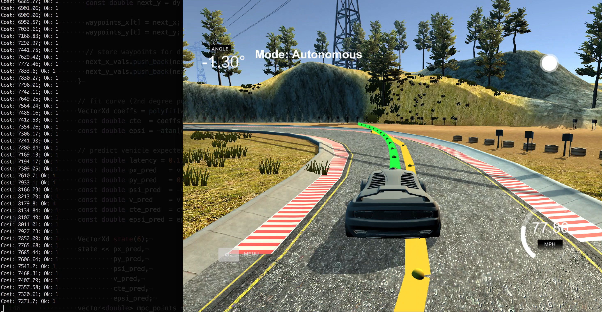

# Model Predictive Control

&nbsp;
*Udacity Self-Driving Car Engineer Nanodegree - Term 2, Project 5*

The goal of this project is to implement a Model Predictive Control algorithm that enables a simulated car to safely follow a pre-determined path. Additionally, in order to better simulate real world conditions, 100ms of latency is injected into the system such that the model will have to cope with the kind of delays that real systems encounter.
